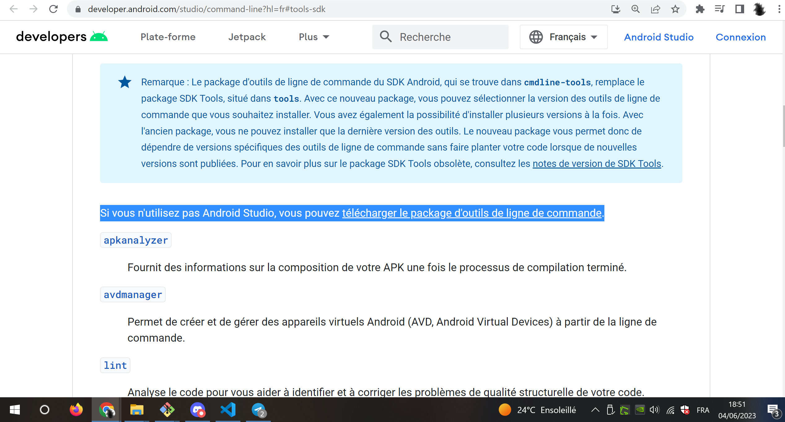
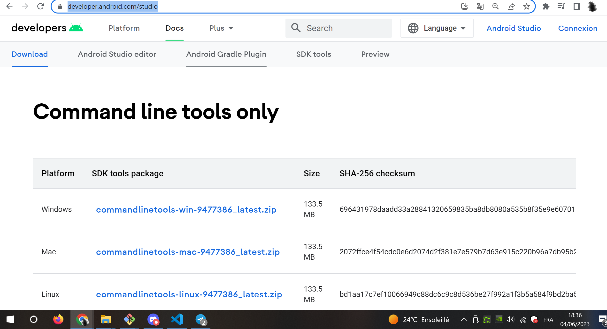

# Install Android SDK

## On windows (with git bash)

* https://developer.android.com/about/versions/14/setup-sdk?hl=fr
* https://developer.android.com/tools/sdkmanager

From [this page](https://developer.android.com/tools/sdkmanager) : 

> 
> 
> The `sdkmanager` is a command-line tool that lets you view, install, update, and uninstall packages for the `Android SDK`. If you're using `Android Studio`, then you don't need to use this tool, and you can instead manage your SDK packages from the IDE.
> 
> 

About the Android SDK Manager : 
* https://developer.android.com/studio/command-line?hl=fr#tools-sdk

On [that page](ccc) we can read that the SDK Manager is one command line tool, but that the android SDK comes along with several command line tools each of which have their own specific purpose, like e.g. `apkanalyzer`

Also on [that page](https://developer.android.com/studio/command-line?hl=fr#tools-sdk), we can read this : 

> 
> 
> Si vous n'utilisez pas Android Studio, vous pouvez [télécharger le package d'outils de ligne de commande](https://developer.android.com/studio#command-tools).
> 

The Android Full SDK without android studio (command line only), is available at https://developer.android.com/studio (June 2023) : 

## References

* Android SDK :
  * https://developer.android.com/about/versions/14/setup-sdk?hl=fr
  * https://developer.android.com/tools/sdkmanager
  * About all the command line tools of the Android SDK : https://developer.android.com/tools
  * how to setup environment variables: https://developer.android.com/studio/command-line/variables?hl=fr#android_sdk_root
  * a tutorial on how to install the SDK : https://guides.codepath.com/android/installing-android-sdk-tools